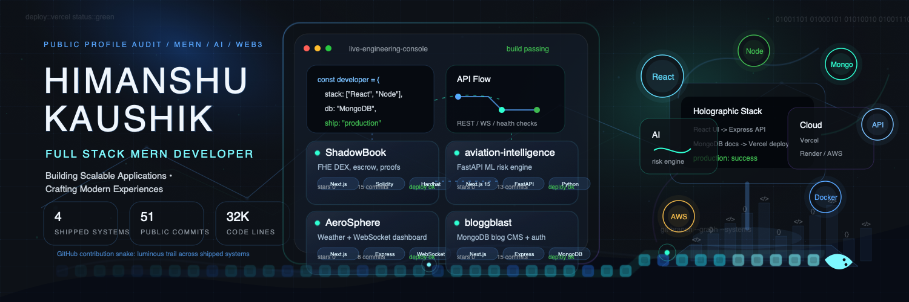

<p align="center">
  
</p>

<h1 align="center">Himanshu Kaushik</h1>

<p align="center">
  <strong>Full Stack MERN Developer</strong> building scalable applications, polished interfaces, and production-ready web systems.
</p>

<p align="center">
  <a href="https://www.linkedin.com/in/himanshu-kaushik-590185329/"></a>
  <a href="mailto:himanshukaushik9813@gmail.com"></a>
  <a href="https://github.com/himanshukaushik9813"></a>
  
</p>

---

## About

I build full-stack products with a bias for clean UI, practical APIs, and deployment-ready architecture. My strongest public work sits across MERN systems, real-time dashboards, AI-backed analytics, and Web3 execution flows.

```ts
const himanshu = {
  role: "Full Stack MERN Developer",
  focus: ["Next.js", "React", "Node.js", "Express", "MongoDB"],
  shipping: ["production dashboards", "REST APIs", "auth flows", "real-time systems"],
  exploring: ["AI products", "Web3 privacy", "scalable cloud architecture"],
  mindset: "build sharp, ship clean, keep improving"
};
```

## Engineering Snapshot

| Signal | Current public profile audit |
| --- | --- |
| Public repositories | 5 |
| Featured production systems | 4 |
| Successful production deployments found | 4 |
| Featured repo commits inspected | 51 |
| Source files inspected | 237 |
| Source lines inspected | 32,641 |
| Strongest public themes | MERN, Next.js, Express APIs, MongoDB, FastAPI, ML dashboards, Web3/FHE |

## Featured Systems

| Project | Why it matters | Stack and signals |
| --- | --- | --- |
| [ShadowBook](https://github.com/himanshukaushik9813/ShadowBook) | Privacy-preserving DEX prototype with encrypted orders, Solidity escrow, CoFHE integration, wallet flows, proofs, and a production-style Next.js app shell. |     <br><sub>Stars: 0 | Commits: 15 | Files: 65 | Deployment: success</sub><br><sub><a href="https://shadow-book-black.vercel.app">Live deployment</a> | JavaScript + Solidity | Updated 2026-03-31</sub> |
| [aviation-intelligence](https://github.com/himanshukaushik9813/aviation-intelligence) | AI-powered aviation disruption dashboard with a Next.js frontend, FastAPI backend, ML risk scoring, analytics endpoints, backend health checks, and deployment configs. |     <br><sub>Stars: 0 | Commits: 13 | Files: 40 | Deployment: success</sub><br><sub><a href="https://aviation-intelligence-three.vercel.app">Live deployment</a> | TypeScript + Python | Updated 2026-03-13</sub> |
| [AeroSphere](https://github.com/himanshukaushik9813/AeroSphere) | Weather intelligence system with a Next.js dashboard, Express API, WebSocket updates, OpenWeather integrations, optional Redis cache, 3D globe, AQI, alerts, and rain prediction. |     <br><sub>Stars: 0 | Commits: 8 | Files: 52 | Deployment: success</sub><br><sub><a href="https://aero-sphere-three.vercel.app">Live deployment</a> | TypeScript + JavaScript | Updated 2026-03-07</sub> |
| [bloggblast](https://github.com/himanshukaushik9813/bloggblast) | Split deployable MERN-style blog platform with Next.js frontend, Express + MongoDB backend, JWT admin auth, CRUD APIs, CORS hardening, and Vercel/Render deployment setup. |     <br><sub>Stars: 0 | Commits: 15 | Files: 80 | Deployment: success</sub><br><sub><a href="https://bloggblast.vercel.app/">Live deployment</a> | TypeScript + JavaScript | Updated 2026-02-13</sub> |

## Deep Audit Highlights

### 1. [ShadowBook](https://github.com/himanshukaushik9813/ShadowBook)
- Encrypted browser-side order payloads with CoFHE/Fhenix primitives
- Solidity smart contract with escrow, matching, cancellation, and settlement paths
- Wallet, proof, assistant, orderbook, and trade-history workspace UI
- SECURITY.md, env examples, deployment and seed scripts

### 2. [aviation-intelligence](https://github.com/himanshukaushik9813/aviation-intelligence)
- FastAPI endpoints for prediction, analytics, high-risk countries, and health
- ML route-risk model using scikit-learn/XGBoost dependency set with fallback inference
- React dashboard with 3D globe, charts, airspace monitoring, and live backend status
- Backend tests, Render config, Vercel config, env examples

### 3. [AeroSphere](https://github.com/himanshukaushik9813/AeroSphere)
- Express REST API for weather, forecast, AQI, alerts, monsoon, and rain prediction
- WebSocket update channel and production API/WS env handling
- 3D globe interactions, geolocation flow, dashboards, and climate widgets
- Deployment guide for Vercel frontend plus Render backend

### 4. [bloggblast](https://github.com/himanshukaushik9813/bloggblast)
- MongoDB blog store with published/draft filtering and CRUD operations
- JWT admin authentication plus auth check/logout endpoints
- CORS wildcard handling for Vercel previews and production apps
- Monorepo split into deployable frontend and backend services

## Tech Stack

<p>
  
  
  
  
  
  
  
  
  
  
  
  
  
  
</p>

## What I Am Building Toward

- Production-grade MERN applications with authentication, database design, clean APIs, and smooth user experience.
- AI-assisted products where dashboards, predictions, and real-time status are useful instead of decorative.
- Scalable frontend systems with Next.js, TypeScript, reusable components, and deployment-safe configuration.
- Backend services with health checks, CORS discipline, environment hygiene, and clear deployment paths.

## GitHub Activity

<p align="center">
  
  
</p>

<p align="center">
  
</p>

## Contribution Snake

<p align="center">
  <picture>
    <source media="(prefers-color-scheme: dark)" srcset="https://raw.githubusercontent.com/himanshukaushik9813/himanshukaushik9813/output/github-snake-dark.svg" />
    <source media="(prefers-color-scheme: light)" srcset="https://raw.githubusercontent.com/himanshukaushik9813/himanshukaushik9813/output/github-snake.svg" />
    
  </picture>
</p>

## Ranking Notes

This profile was generated from the public GitHub profile and repository audit. Current public star/fork counts are early-stage, so project priority is based on shipped deployments, recency, code depth, stack relevance, README/code signals, and production engineering evidence.

<p align="center">
  <strong>Open to collaboration on MERN apps, AI dashboards, and production-grade web products.</strong>
</p>
